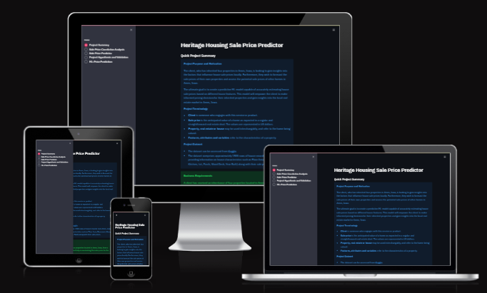
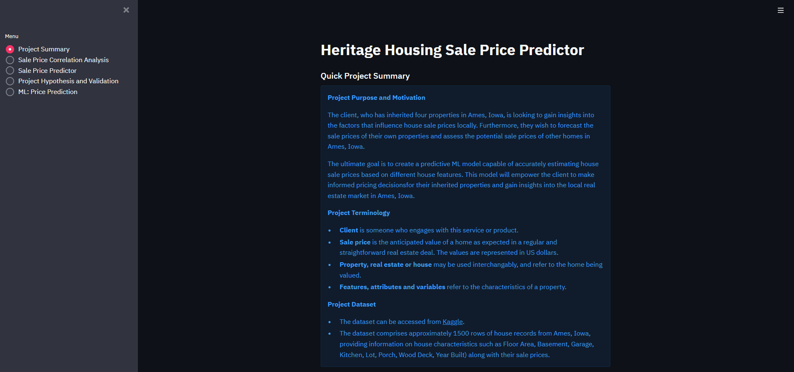
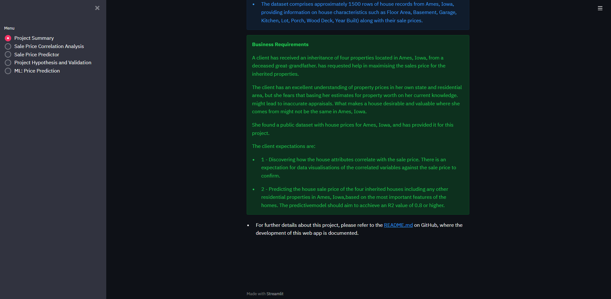
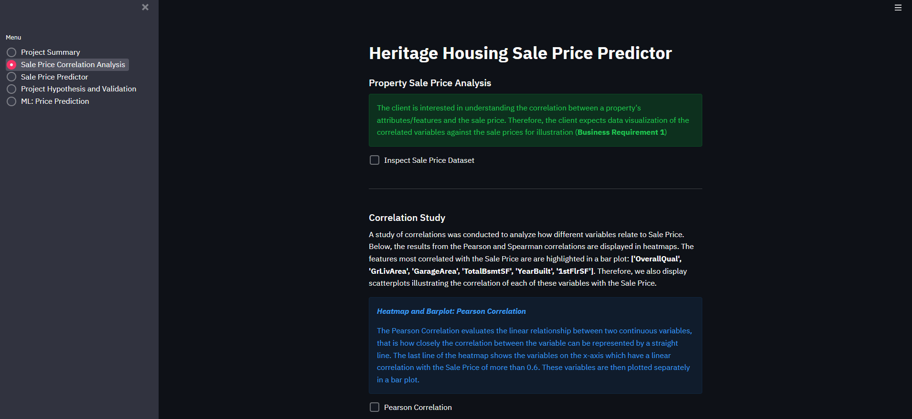
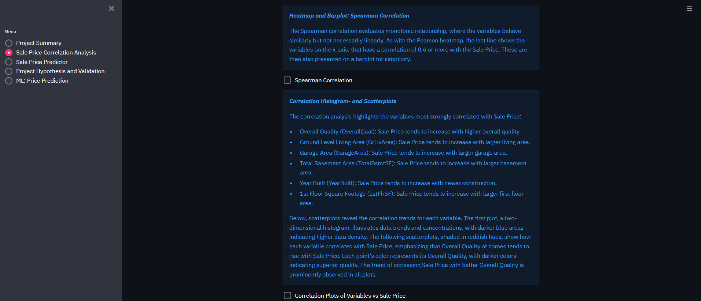
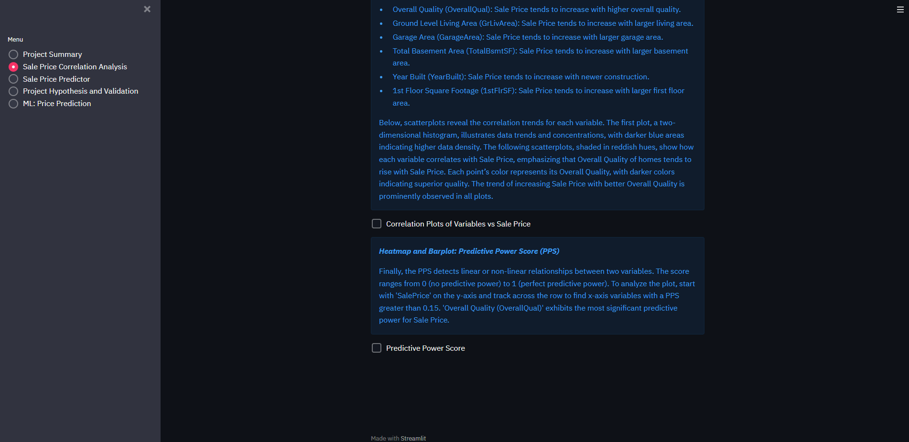
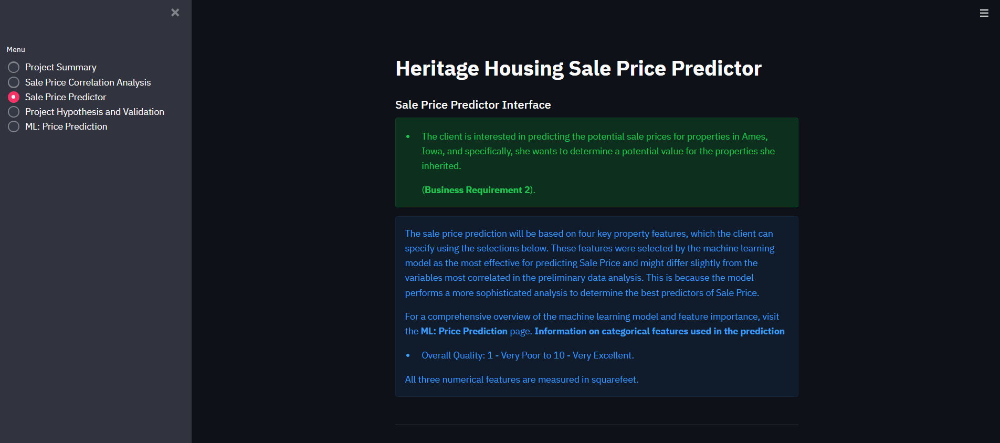
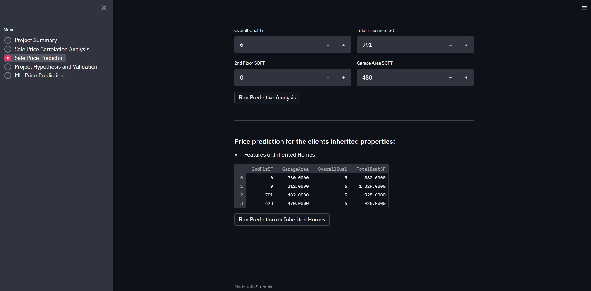
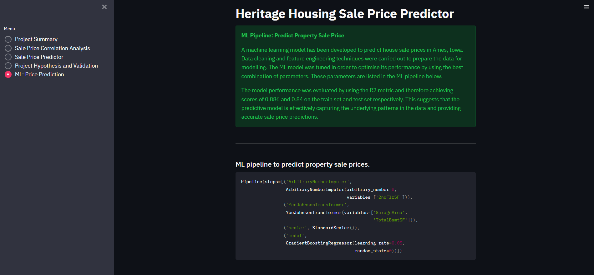
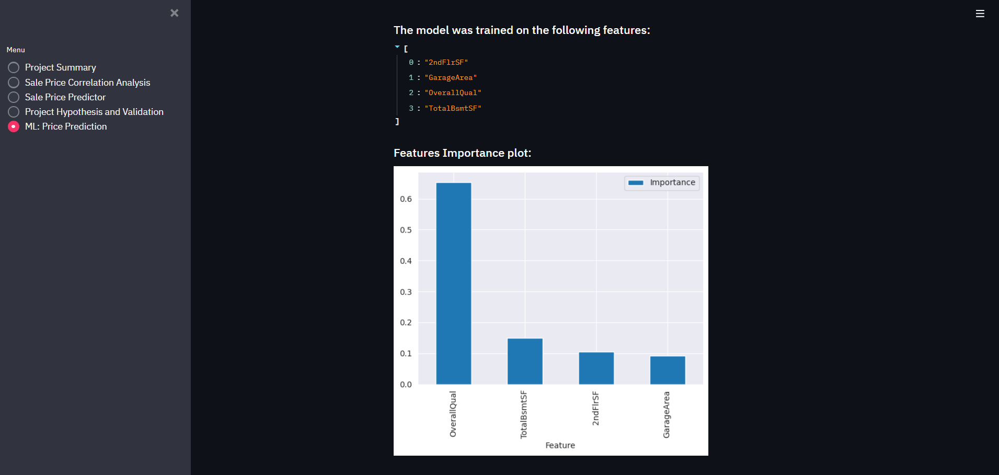

# Heritage Housing Issues

**Live Site:** [Live webpage](https://pp5-heritage-housing-sale-97893c8293d5.herokuapp.com/)

**Link to Repository:** [Repository](https://github.com/EdsonSMartins/PP5-heritage-housing)

## Table of Contents
- [Introduction](#introduction)
- [CRISP-DM Workflow](#crisp-dm-workflow)
- [Business Requirements](#business-requirements)
- [Dataset Content](#dataset-content)
- [Hypotheses for Case Study](#hypotheses-for-case-study)
- [Mapping the business requirements to the Data Visualisations and ML tasks](#mapping-the-business-requirements-to-the-data-visualisations-and-ml-tasks)
- [ML Business Case](#ml-business-case)
- [Dashboard Design](#dashboard-design)
- [Testing](#testing)
- [Unfixed Bugs](#unfixed-bugs)
- [Deployment](#deployment)
- [Technologies](#technologies)
- [Credits](#credits)
- [Acknowledgements](#acknowledgements)

## Introduction
This is the fifth project portfolio developed during the Code Institute's Full Stack Developer program. 

The project purpose is to build build a Data App with a Machine Learning User Interface (UI) combining: (1) Python packages for Machine Learning, Data Analysis and Data Visualisations; and (2) Streamlit for fast Machine Learning prototyping. 

The Maching Learning and Data Analysis toolkit is applied to a real estate data set and developed with the specific purpose to allow a user to predict the portencial sales price of a property based on certain features of the home.

## CRISP-DM Workflow

The project was developed using the Cross Industry Standard Process for Data Mining. This follows several iterations over well defined steps:

1. **Epic 1: Business Understanding** -  Understand the project objectives and requirements from a business perspective. This step lays the foundation for the entire project by clarifying the goals and how they relate to the business needs. You can find more details on [Business Requirements](#business-requirements) section.
2. **Epic 2: Data Understanding** - Collect and understand the initial data to identify data quality issues, discover initial insights, and detect interesting subsets to form hypotheses.  This step is crucial for ensuring the data is suitable for the project's needs. This task is carried out in the Data Cleaning Notebook.
3. **Epic 3: Data Preparation** - Prepare the final dataset from the initial raw data, which includes all the necessary steps to construct the final dataset from the initial raw data. This step often involves significant effort and time. This task is carried out in the Data Cleaning and Feature Engineering Notebooks.
4. **Epic 4: Modelling** - Select and apply various modeling techniques and tune their parameters to optimal values. This step involves iterative experimentation to find the best models. This is carried out in the ModelEvalRegression_v1 Notebook.
5. **Epic 5: Evaluation** - Thoroughly evaluate the model to ensure it meets the business objectives and is robust and reliable. This step ensures that the model performs well on unseen data and aligns with business goals.  This is carried out in the ModelEvalRegression_v1 and ModelEvalRegression_v2 Notebooks.
6. **Epic 6: Deployment** -Deploy the models into the live environment where they will be used to generate insights and/or decisions. This step includes planning for maintenance and monitoring of the deployed models. The app is deployed in Heroku and the process is described in the [Deployment](#deployment) section below.

These steps are iterative, meaning that based on the findings at any stage, it may be necessary to revisit previous steps to refine and improve the project outcomes.

## Business Requirements

A client who has received an inheritance of four properties from a deceased great-grandfather located in Ames, Iowa, has requested help in maximising the sales price for the inherited properties.

The client has an excellent understanding of property prices in her own state and residential area, but she fears that basing her estimates for property worth on her current knowledge might lead to inaccurate appraisals. What makes a house desirable and valuable where she comes from might not be the same in Ames, Iowa. She found a public dataset with house prices for Ames, Iowa, and has provided it for this project.

The client expectations are:

1 - Discovering how the house attributes correlate with the sale price. There is an expectation for data visualisations of the correlated variables against the sale price to confirm.
  
2 - Predicting the house sale price of the four inherited houses including any other residential properties in Ames, Iowa, based on the most important features of the homes. The predictive model should aim to acchieve an R2 value of 0.8 or higher.

## Dataset Content

- The dataset is sourced from [Kaggle](https://www.kaggle.com/codeinstitute/housing-prices-data).
- The dataset consists of almost 1.5 thousand rows and represents housing records from Ames, Iowa, indicating house profiles made up of, but not limited to (Floor Area, Basement, Garage, Kitchen, Lot, Porch, Wood Deck, Year Built) and its respective sale price for houses built between 1872 and 2010.

|Variable|Meaning|Units|
|:----|:----|:----|
|1stFlrSF|First Floor square feet|334 - 4692|
|2ndFlrSF|Second-floor square feet|0 - 2065|
|BedroomAbvGr|Bedrooms above grade (does NOT include basement bedrooms)|0 - 8|
|BsmtExposure|Refers to walkout or garden level walls|Gd: Good Exposure; Av: Average Exposure; Mn: Minimum Exposure; No: No Exposure; None: No Basement|
|BsmtFinType1|Rating of basement finished area|GLQ: Good Living Quarters; ALQ: Average Living Quarters; BLQ: Below Average Living Quarters; Rec: Average Rec Room; LwQ: Low Quality; Unf: Unfinshed; None: No Basement|
|BsmtFinSF1|Type 1 finished square feet|0 - 5644|
|BsmtUnfSF|Unfinished square feet of basement area|0 - 2336|
|TotalBsmtSF|Total square feet of basement area|0 - 6110|
|GarageArea|Size of garage in square feet|0 - 1418|
|GarageFinish|Interior finish of the garage|Fin: Finished; RFn: Rough Finished; Unf: Unfinished; None: No Garage|
|GarageYrBlt|Year garage was built|1900 - 2010|
|GrLivArea|Above grade (ground) living area square feet|334 - 5642|
|KitchenQual|Kitchen quality|Ex: Excellent; Gd: Good; TA: Typical/Average; Fa: Fair; Po: Poor|
|LotArea| Lot size in square feet|1300 - 215245|
|LotFrontage| Linear feet of street connected to property|21 - 313|
|MasVnrArea|Masonry veneer area in square feet|0 - 1600|
|EnclosedPorch|Enclosed porch area in square feet|0 - 286|
|OpenPorchSF|Open porch area in square feet|0 - 547|
|OverallCond|Rates the overall condition of the house|10: Very Excellent; 9: Excellent; 8: Very Good; 7: Good; 6: Above Average; 5: Average; 4: Below Average; 3: Fair; 2: Poor; 1: Very Poor|
|OverallQual|Rates the overall material and finish of the house|10: Very Excellent; 9: Excellent; 8: Very Good; 7: Good; 6: Above Average; 5: Average; 4: Below Average; 3: Fair; 2: Poor; 1: Very Poor|
|WoodDeckSF|Wood deck area in square feet|0 - 736|
|YearBuilt|Original construction date|1872 - 2010|
|YearRemodAdd|Remodel date (same as construction date if no remodelling or additions)|1950 - 2010|
|SalePrice|Sale Price|34900 - 755000|

## Hypotheses for Case Study
The following are the hypotheses that I have made for this project:

1. The sale price of a property is assumed to be correlated with all features of the house.
    - Correlation study present a differente information where not all features have significant correlation with the sale price of a property. The Study also shows that sale price correlates strongly with features that are commom to most properties such as Groundlevel Living area (GrLivArea), Garage Area (GarageArea), Total Basement Area (TotalBsmtSF), Year Built (YearBuilt), and 1st Floor squarefootage (1stFlrSF).

2. We expect a higher price for properties with larger built up area.
    - This is correct, according to pearson correlation studies, we can identify a linear relation between sale price and Above Ground Living Area (GrLivArea) Total square feet of Basement Area (TotalBsmtSF), 1st floor square feet (1stFlrSF) and Garage Area (GarageArea).

3. The quality and condition of a property, as indicated by features like OverallQual, show a positive correlation with the sale price. Higher-quality properties generally command higher sale prices.
    -The correlation study shows that Overall quality is one of most correlated feature with the target Sale Price. The modeling and evalation shows that Overall quality is the most important feature to predict the Sale Price.

## Mapping the business requirements to the Data Visualisations and ML tasks

## Business Requirement 1:
Data Visualization and Correlation.

- Inspect the dataset to explore how its data correlates with property sale prices.
- Utilize Pearson and Spearman correlation methods to investigate how the variables are related to the sale price more comprehensively.
- The most crucial and relevant data will be plotted against the sale price to help visualize the insights.

## Business Requirement 2:
Regression and Data Analysis.

- To forecast the sale price of homes in Ames, Iowa, we will develop a regression model with sale price as the target variable.
- We will carry out optimization and evaluation steps in order to acchieve an R2 value of 0.8 or higher.

## ML Business Case
#### Predict House Prices in Ames, Iowa

1. What are the business requirements?
    * The client wants to identify the correlation(s) between the features of a property, and the sale price of a speciic property.
    * The client wants to be able to estimate/predict the sale price of their 4 inherited houses, or any other houses in Ames, Iowa, as a cosideration for future property investments.
2. Is there any business requirement that can be answered with conventional data analysis?
    * We can use Data Analasys to identify those property features most closely correlated to the sale price of a house.
3. Does the client need a dashboard or an API endpoint?
    * The client only needs a dashboard in this instance.
4. What does the client consider as a successful project outcome?
    * A dashboard showing the most closely correlated features of a house, to the sale price.
    * The ability to estimate/predicts the sale price for the 4 inherited houses or any other house in Ames, Iowa.
5. Can you break down the project into Epics and User Stories?
    * Gathering requirements and collecting data.
    * Datacleaning, visualization and preparation.
    * Model training and optimization.
    * Dashboard designing and development.
    * Dashboard deployment.
6. Ethical or Privacy concerns?
    * As the data is a public data set, there are not concerns.
7. Does the data suggest a particular model?
    * The data suggests a regressor where the target is the sale price.
8. What are the model's inputs and intended outputs?
    * The inputs consist of the public data set including house features and sale price.
    * The outputs are the correlation studies and visualizations, as well as the ability to estimate/predict a properties' sale price.
9. What are the criteria for the performance goal of the predictions?
    * An R2 score of at least 0.75 on the train set and  the test set.
10. How will the client benefit?
    * The client will be able to estimate the sale price of the inherited properties, based on data analysis and not just opinion.
    * The client will also be able to estimate/predict the sale price of future investment properties. This can help in deciding which properties to buy, what changes to make to properties to get a higher sale price etc...
## Dashboard Design

This section introduces the use of the Streamlit dashboard APP that would be delivered to the client as requested.

### Page 1: Project Summary

This page will incude:

- Statement of the project purpose.
- Project terminology.
- Brief description of the data set.
- Statement of business requirements.
- Links to further information.

Project Summary Page Screenshots

### Page 2: Sale Price Correlation Analysis

This page will satisfy the first business requirement. It provides checkboxes enabling the client to display visual guides for the following data features:

- A sample of data from the data set.
- Pearson and spearman correlation plots between the features and the sale price.
- Histogram and scatterplots of the most important predictive features.
- Predictive Power Score analysis.

Project Summary Page Screenshots

### Page 3: Sale Price Prediction

This page will satisfy the second Business Requirement. It will include:

- Feature to forecast the price of any house in Ames, Iowa.
- Provides an House Price Predictor interface.
- Feature to predict the sale prices of the clients specific data in relation to her inherited properties.

Project Summary Page Screenshots

### Page 4: Hypothesis and Validation

This page will include:

- A summary of the project's hypotheses and the processes used for their validation.

Project Summary Page Screenshots

### Page 5: Machine Learning Model

This page will include

- Briefly conclusion about the performance of the ML model.
- Demonstration of feature importance.
- Shows Performance and evaluation by using R2 metric

Project Summary Page Screenshots

## Testing
### PEP8 Compliance Testing 
All python files where passed through the [CI Python Linter](https://pep8ci.herokuapp.com/).[CI Python Linter](https://pep8ci.herokuapp.com/).  

### Manual Testing
The deployed app has been thoroughly tested to ensure data visualisations are properly displayed and sale price predictions run correctly.

## Unfixed Bugs
The app does not currently contain any unfixed bugs.

## Deployment
### Heroku
* The App live link is: https://pp5-heritage-housing-sale.herokuapp.com
* Set the runtime.txt Python version to a [Heroku-20](https://devcenter.heroku.com/articles/python-support#supported-runtimes) stack currently supported version.
* The project was deployed to Heroku using the following steps.

1. Log in to Heroku and create an App
2. At the Deploy tab, select GitHub as the deployment method.
3. Select your repository name and click Search. Once it is found, click Connect.
4. Select the branch you want to deploy, then click Deploy Branch.
5. The deployment process should happen smoothly if all deployment files are fully functional. Click the button Open App on the top of the page to access your App.
6. If the slug size is too large then add large files not required for the app to the .slugignore file.

## Technologies
### Development and Deployment

- [GitHub](https://github.com/) was used to create the project repository, story project files and record commits.
- [GitPod](https://www.gitpod.io/) was used as the development environment.
- [Streamlit](https://streamlit.io/) was used to develop the online app interface.
- [Jupyter Notebooks](https://jupyter.org/) were used to analyse and engineer the data, and develop and evaluate the model pipeline.
- [Heroku](https://www.heroku.com/) was used to deploy the project.
- [Kaggle](https://www.kaggle.com/) was used to access the dataset

### Data Analysis and Machine Learning

- [NumPy](https://numpy.org/) was used for mathematical operations for examples determining means, modes, and standard deviations.
- [Feature Engine](https://feature-engine.trainindata.com/en/latest/index.html) was used for various data cleaning and preparation tasks.
- [SciKit Learn](https://scikit-learn.org/stable/) was used for many machine learning tasks.
- [Pandas](https://pandas.pydata.org/) was used for reading and writing data files, inspecting, creating and manipulating series and dataframes.
- [ydata_profiling](https://ydata-profiling.ydata.ai/docs/master/index.html) was used to create an extensive Profile Report of the dataset.
- [PPScore](https://pypi.org/project/ppscore/) was used to determine the predictive power score of the data features.
- [MatPlotLib](https://matplotlib.org/) and [Seaborn](https://seaborn.pydata.org/) were used for constructing plots to visualize the data analysis.
## Credits
### Sources of code

- The CI Churnometer Walkthrough Project and the CI course content was used to source various functions and classes in the development process.
- The CI Churnometer Walkthrough Project was also the source of the Steamlit pages which were then modified and adapted to the app deployed in this project.

## Acknowledgements

Many thanks and appreciation go to the following sources and people:
* The code institue for use for the [chernomter walkthrough project](https://www.kaggle.com/datasets/codeinstitute/housing-prices-data) to base this project off, as well as the [template](https://github.com/Code-Institute-Solutions/milestone-project-heritage-housing-issues) for this project.
* Several past projects provided valuable additional information on how to complete a successful project:
    * Heritage Housing Issues project by T. Hullis [Link](https://github.com/t-hullis/milestone-project-heritage-housing-issues)
    * Heritage Housing Issues project by Faridjos[Link](https://github.com/faridjos/milestone-project-heritage-housing-issues)
* [StackOverflow](https://stackoverflow.com/)
*  Precious Ijege, my mentor, contributed valuable feedback on project improvements during our mentor meetings.